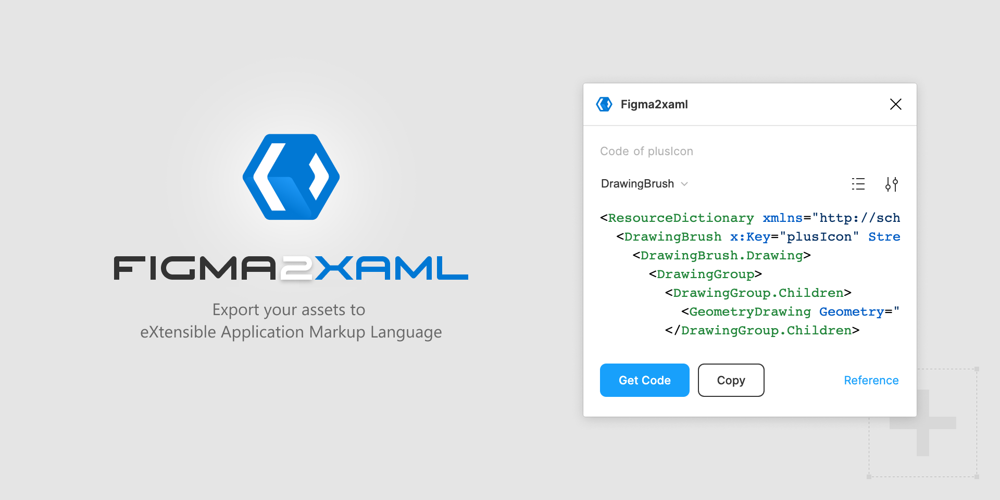

# Figma2xaml

This plugin can help you convert simple vector paths to xaml (eXtensible Application Markup Language). Don't forget to simplify all the elements into vector paths using boolean operations ([see screencast](https://github.com/igorageev/figma2xaml/blob/main/trick.md)) or commands "Flatten" and "Outline Stroke".

https://www.figma.com/community/plugin/1029415284789228817/Figma2xaml



This boilerplate using for creating plugin:
https://github.com/thomas-lowry/figsvelte

## Usage

1. Select the required code format from the dropdown menu
2. Select only one layer with frame, group, component or instance
3. Press `Get code`  and then `Copy` button
4. Create from it a Resource Dictionary in Visual Studio

## Supported features:

- [GeometryDrawing](https://docs.microsoft.com/en-us/dotnet/api/system.windows.media.geometrydrawing)
- [Path](https://docs.microsoft.com/en-us/uwp/api/windows.ui.xaml.shapes.path)
- [Brush](https://docs.microsoft.com/en-us/dotnet/api/system.windows.media.geometrydrawing.brush)
- [LinearGradientBrush](https://docs.microsoft.com/en-us/dotnet/api/system.windows.media.lineargradientbrush)
- [Pen](https://docs.microsoft.com/en-us/dotnet/api/system.windows.media.geometrydrawing.pen)
- [Transparent color](https://docs.microsoft.com/en-us/dotnet/api/system.windows.media.color.a)

## Installation and contributing

1. Clone the repository: `git clone https://github.com/igorageev/figma2xaml.git`
2. Go to the directory: `cd figma2xaml`
3. Install the packages: `npm install`
5. Add a new development plugin to Figma
6. Select the `figma2xaml/build/manifest.json` file as the manifest

## Development

During development, watch your project for changes with the following command:

```bash
npm run dev
```

Start editing plugin UI in `'src/Plugin.svelte'`.

## Build

When ready to package:

```bash
npm run build
```

_For info about Figma API visit [Figma API Overview](https://www.figma.com/plugin-docs/api/api-overview/)_
