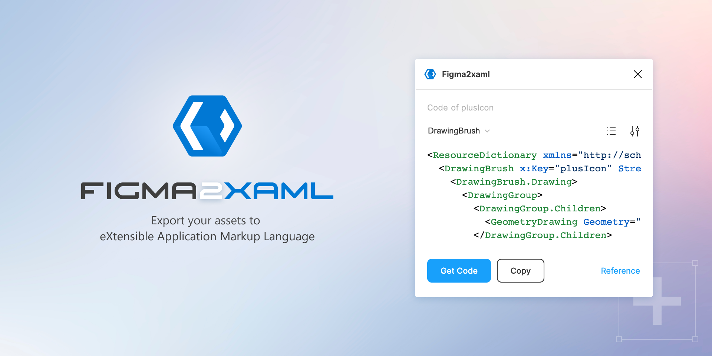

# Figma2xaml

This plugin can help you convert simple vector paths to xaml (eXtensible Application Markup Language). Don't forget to simplify all the elements into vector paths using the commands "Flatten" and "Outline Stroke".

https://www.figma.com/community/plugin/1029415284789228817/Figma2xaml



This boilerplate using for creating plugin:
https://github.com/thomas-lowry/figsvelte


## Development

During development, watch your project for changes with the following command.

```bash
npm run dev
```

Start building your plugin UI in `'src/Plugin.svelte'`.

## Build

When ready to package up your final Figma Plugin:

```bash
npm run build
```

_For info about Figma API visit [Figma API Overview](https://www.figma.com/plugin-docs/api/api-overview/)_
